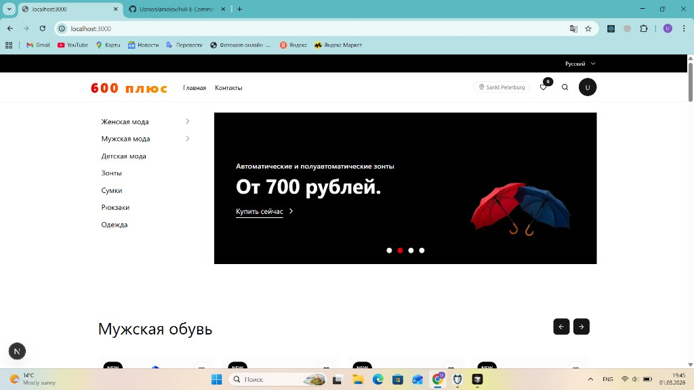
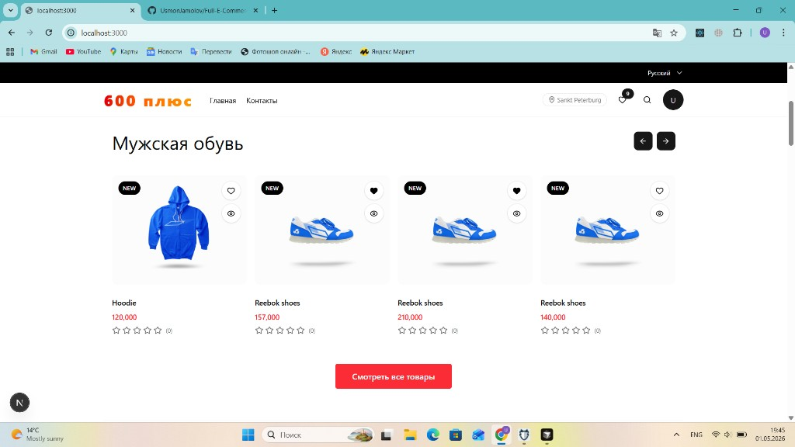
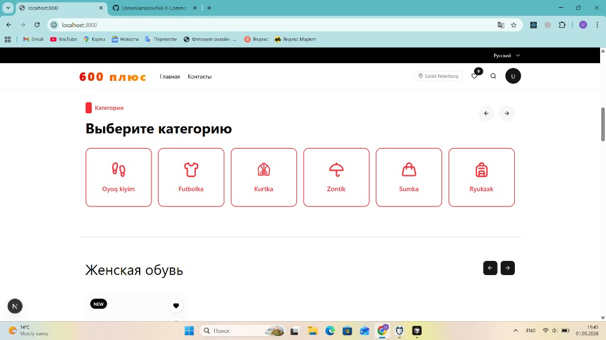
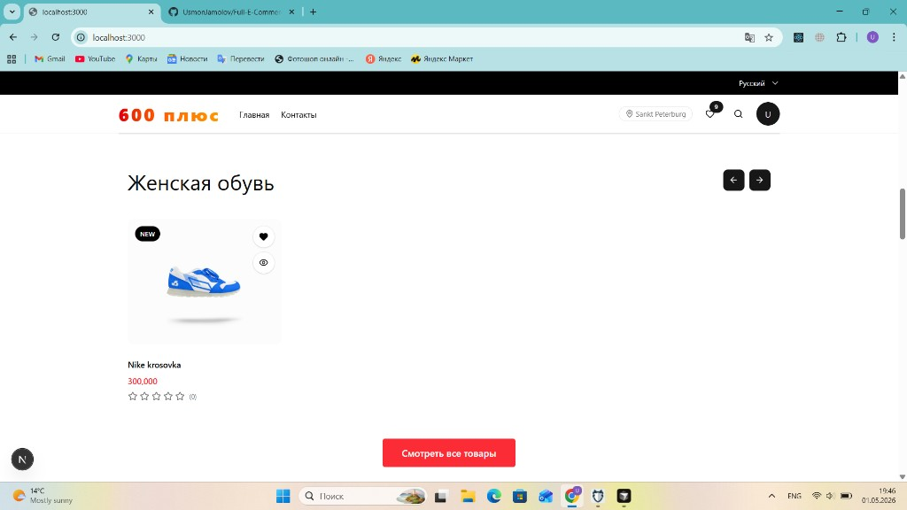
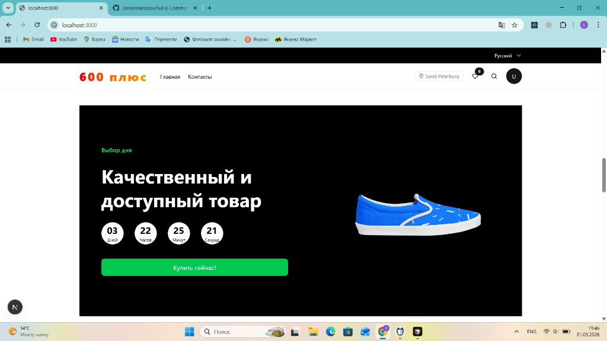
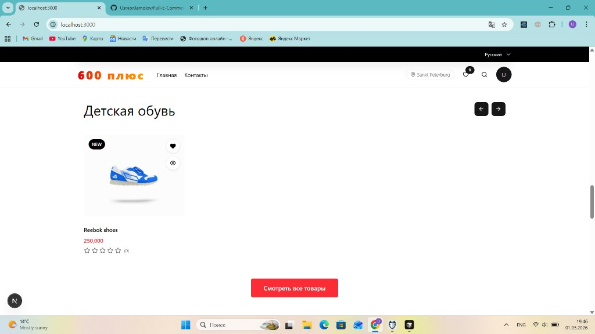
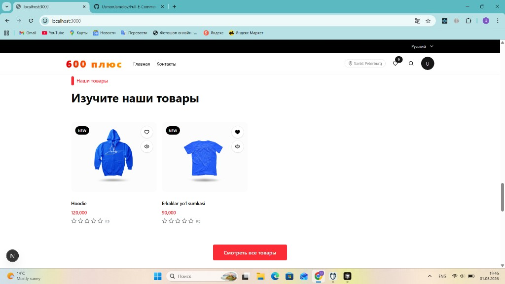
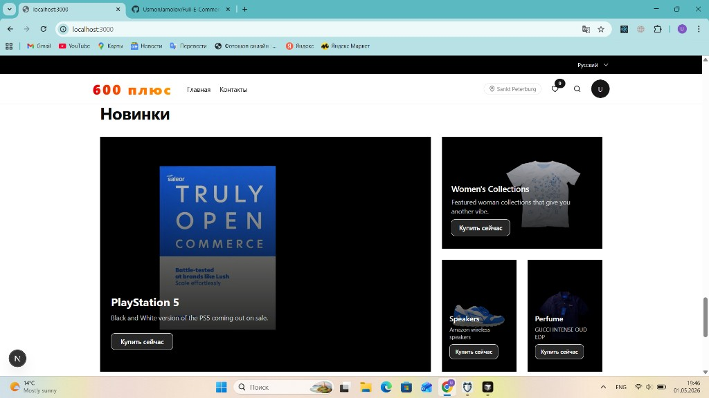
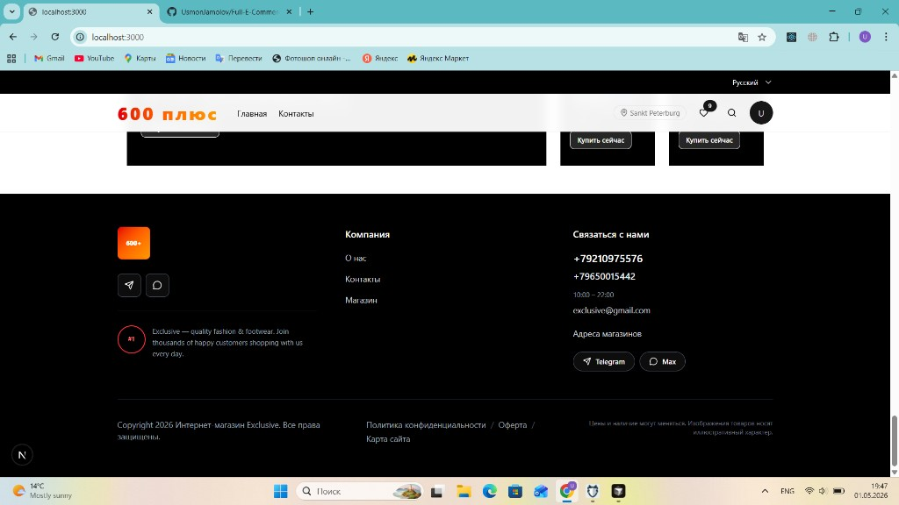

# Full E-Commerce UI/UX Project

Современный полнофункциональный e-commerce проект с клиентской витриной и административной панелью.  
Приложение построено на `Next.js` (frontend) и `Node.js/Express` (backend), поддерживает каталог товаров, фильтрацию, избранное, блоки главной страницы, мультиязычность интерфейса и управление контентом через админку.

## Структура репозитория

- `e-commerce` — frontend приложение на Next.js
- `server` — backend API на Express + MongoDB

## Технологии

- `Next.js`
- `React`
- `TypeScript`
- `Tailwind CSS`
- `Node.js`
- `Express`
- `MongoDB`

## Запуск проекта

```bash
# frontend
cd e-commerce
npm install
npm run dev
```

## Скриншоты проекта

### Главная страница (верхняя часть)


### Секция мужской обуви


### Секция категорий


### Секция женской обуви


### Промо-блок Buy Now


### Секция детской обуви


### Секция "Наши товары"


### Секция новинок


### Футер

